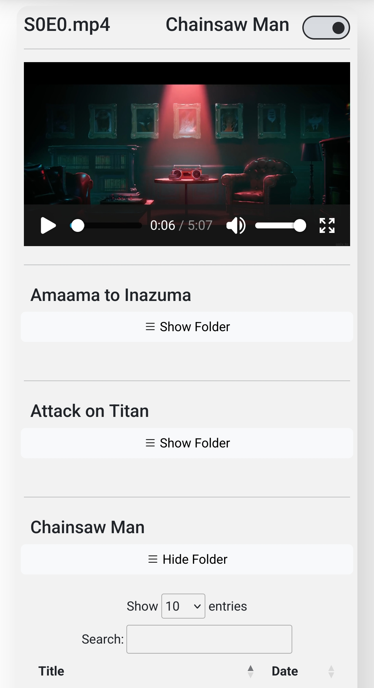

## !! Complete !!
This branch will not change (outside of bug fixes), and I will never merge it into the main branch. It is a clone of the original lightweight version made before Laravel integration.

### This is a simple web-based media hosting server.

It is designed as a home server and provides fast and easy access to media. 
Videos are grouped by folders and listed in a table with the file name and date. 
The website is responsive by design and works on mobile devices. HVEC support depends on the device used. 

## Installation

### Requirements
- Apache 2.4.x
- PHP 8.x (Thread Safe)

#### Setup
- Set your document root to this folder in Apache's httpd.conf file.
- Create symbolic links in the resources folder that point to where videos are stored.
    - The default folder is defined on the second line of index.php as RESOURCE_DEFAULT.  
    It's shown when the user does not specify a folder in the URL.
- Optionally, you can set up Apache virtual hosts using the snippet provided in doc/setup to add security and support multiple websites on the same Apache server. It will prevent directory indexing, which allows anyone to browse your resources folder directly by default. 

#### Usage
- The URL will be your public IP address, followed by the port used by your Apache server.
- Different folders are accessed with ?dir=foldername after the website's URL.

#### Supported File Types
- MP4
- MKV
<h6>You can support more file types by adding them to the FILE_TYPES array in the config.php file.</h6>

## Demo

Below are screenshots of the current webpage on Desktop and Android.

!
!

|||
|:-:|:-:|
|Dark Mode on Desktop|Light Mode on Android|
